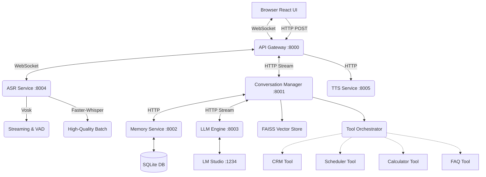

# 🏥 City Medical Clinic — Conversational AI Receptionist

A fully local, production-style conversational AI system simulating a medical clinic front desk receptionist with **real-time voice streaming**, **RAG knowledge retrieval**, and **autonomous tool execution**.

## 🎯 Business Use Case

**Doctor's Front Desk Assistant** — An AI receptionist named "Sara" that:
- Greets patients and collects their information
- Answers clinic FAQs using **RAG (Retrieval-Augmented Generation)**
- Autonomously books appointments and calculates costs via **Tool Calling**
- Supports seamless **real-time continuous dictation**
- Maintains patient history across sessions
- Operates strictly within clinic domain with strict medical guardrails

---

## 🏗️ System Architecture


### Microservices

| Service | Port | Responsibility |
|---------|------|----------------|
| API Gateway | 8000 | WebSocket proxy, request routing, session creation |
| Conversation Manager | 8001 | Intent classification, RAG retrieval, Tool execution, Prompt building |
| Memory Service | 8002 | Long-term SQLite CRUD, patient profiles, session context |
| LLM Engine | 8003 | LM Studio API wrapper, streaming inference |
| ASR Service | 8004 | **Dual Engine**: Vosk (Streaming WS) + faster-whisper (Batch) |
| TTS Service | 8005 | piper-tts text-to-speech synthesis |

---

## 🚀 Key Features Built

### 1. Dual-Engine ASR & Continuous Dictation
- **Streaming (Vosk)**: Real-time 16kHz PCM WebSocket streaming with built-in Voice Activity Detection (VAD). Dictation intelligently auto-stops after 1.5s of silence and allows seamless concatenations.
- **Batch (Whisper)**: High-quality fallback using `faster-whisper` (int8 quantization).

### 2. RAG Knowledge System
- FAISS vector store utilizing `all-MiniLM-L6-v2` embeddings.
- Ingests clinic info, procedures, and FAQs from `.txt` documents.
- Retrieves top-k contexts dynamically via an optimized `asyncio` parallel fetch.

### 3. Intent Classification & Tool Orchestration
- **Intent Router**: Classifies user prompts into "Knowledge", "Action", or "General" to save TTFT (Time-To-First-Token) overhead.
- **Tool Orchestrator**: Uses JSON-regex parsing to allow the 3B parameter model to natively execute tools (Book Appointments, Update Patient, Calculate Math).
- Tool calls are buffered to ensure clean UX (hiding JSON from the frontend).

### 4. Memory & Performance
- **LRU Cache**: Frequently asked questions are cached with a TTL to provide instantaneous responses.
- **Patient Linking**: Automatically extracts names and phone numbers via background tasks to link cross-session histories.

### 5. Full Evaluation Suite
- Includes an automated benchmarking tool (`run_evals.py`) to measure:
  - RAG Precision, Recall, and Faithfulness
  - Tool Execution Pass Rates
  - Conversational Coherece & Guardrail Adherence
  - Pipeline Latency (TTFT)

---

## 🤖 Model Selection

| Property | Value |
|----------|-------|
| LLM | Qwen2.5-3B-Instruct (Q4_K_M) |
| Embeddings | all-MiniLM-L6-v2 |
| ASR Streaming | Vosk (`vosk-model-en`) |
| ASR Batch | faster-whisper (`base` model) |
| TTS | Piper-tts (`en_US-lessac-medium`) |
| Hardware | CPU-Optimized |

---

## 🚀 Setup Instructions

### Prerequisites
- Docker Desktop
- LM Studio with `Qwen2.5-3B-Instruct-Q4_K_M` running on port 1234
- Node.js v22+

### 1. Start All Backend Services (Docker)
```bash
docker-compose up --build
```
*(Note: First build takes longer as it downloads the Whisper, Vosk, and Piper models.)*

### 2. Start Frontend
```bash
cd frontend
npm install
npm start
```
Frontend runs on `http://localhost:3000`

### 3. Run Evaluation Suite
```bash
python run_evals.py --all
```
Generates a comprehensive `evals/report.md`.

---

## 📁 Project Structure
```text
doctor-chatbot/
├── gateway/                 # API Gateway (Port 8000)
├── conversation/            # Conversation Manager (Port 8001)
│   ├── app/rag/             # FAISS index and retrievers
│   ├── app/tools/           # Tool orchestrator & functions
│   └── app/cache.py         # LRU caching logic
├── memory/                  # Memory Service (Port 8002)
├── llm/                     # LLM Engine (Port 8003)
├── asr/                     # ASR Service (Port 8004) [Whisper + Vosk]
├── tts/                     # TTS Service (Port 8005)
├── evals/                   # Evaluation suite metrics & reports
├── frontend/                # React Frontend (Voice UI + Dictation mode)
├── run_evals.py             # Evaluation runner script
├── docker-compose.yml       
└── README.md
```
